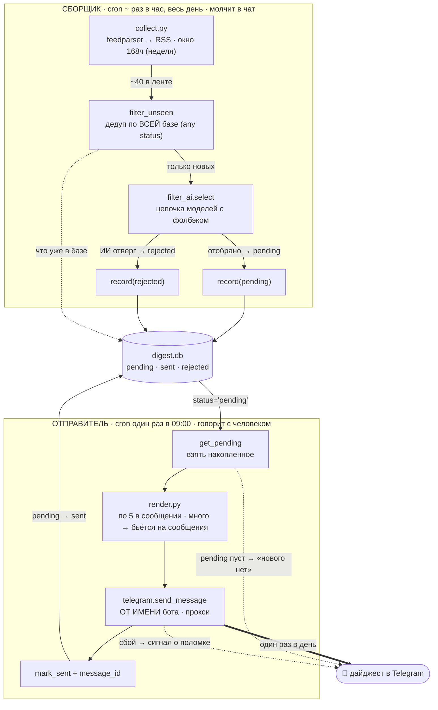
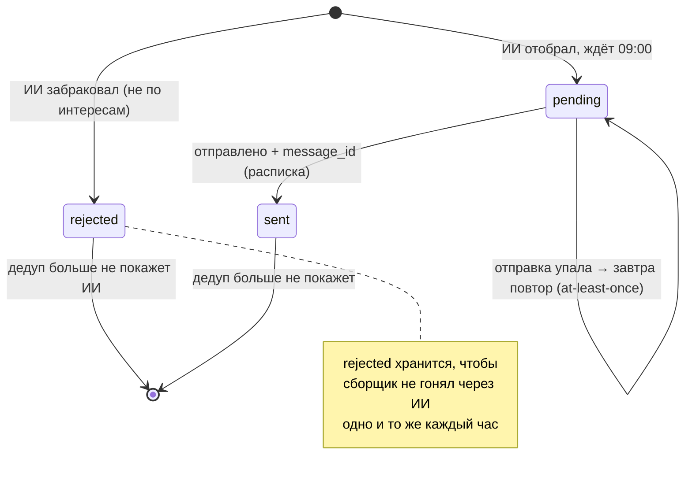

# svc-digest — карта конвейера (урок 6.09)

Диаграмма-как-код. Правится вместе с кодом, живёт рядом с ним.

**Архитектура: две развязанные работы, общаются через базу** (producer/consumer).
Сбор и отправка разделены: в 9:00 дайджест уже лежит готовым в базе — отправка
не зависит от того, живы ли в этот момент RSS и ИИ.

## Две работы

## Жизненный цикл одной новости

## Почему развязка сильнее монолита

| Свойство | Что даёт |
|---|---|
| **Отправка зависит только от Telegram** | 429 от ИИ и падение ленты уехали в сборщик; в 9:00 они не важны — дайджест уже готов |
| **Сборщик ретраится сам** | лёг провайдер в 03:00 — подберёт в 04:00; к 9:00 база полная |
| **Новости копятся весь день** | вышло в 14:00 — сборщик в 15:00 подобрал; не один снимок в 9:00 |
| **Дайджест «пре-готовый»** | в базе лежит уже отобранное с выжимками; отправитель не думает, только форматирует |

## Ключевые решения

| Решение | Почему так |
|---|---|
| **Дедуп по ВСЕЙ базе** (pending+sent+rejected) | «есть в базе → отбрасываем»; не гоняем через ИИ то, что уже видели |
| **rejected хранится** | иначе отклонённое ИИ вернётся в обработку каждый час, пока не выпадет из окна |
| **Окно сбора 168ч (неделя), развязано с отправкой** | окно = запас прочности на простой сборщика (лежал 3 дня → догоним за неделю). Повторы режет ДЕДУП по всей базе, не окно — поэтому окно и частота отправки независимы, широкое окно не даёт дублей и в устойчивом режиме = как 48ч |
| **Ключ = guid, иначе link** | link тащит UTM-хвосты → дубли; guid стабилен |
| **Цепочка моделей с фолбэком** | free-тариф отдаёт 429 по воле провайдера |
| **Модель возвращает НОМЕР, не URL** | не может подсунуть выдуманную ссылку — берём оригинал по индексу |
| **outbox: pending → sent + message_id** | «точно ушло» = расписка Telegram; сбой отправки → завтра повтор, не потеря |
| **Своя база, отдельная от бота** | один писатель у SQLite (6.04); PII заявок дайджесту не нужны; свой blast radius |
| **Бот = личность-отправитель** | sendMessage stateless, с polling бота не конфликтует |
| **Сигнал в любом исходе — только у отправителя** | сборщик молчит в чат (ретрай раз в час завалил бы уведомлениями), шумит только в лог |

## Известные хвосты (не блокеры MVP)

- ИИ-отбор недетерминирован: пограничные записи проходят то так, то эдак
- Мелкие модели изредка роняют иероглиф/англ. слово в выжимке
- Один источник (расширение по одной ленте)
- Токен бота — копия в двух .env; при ротации два места
- Если сборщик долго молча сломан — отправитель шлёт «нового нет», не отличить от реального затишья (мониторинг — на потом)
