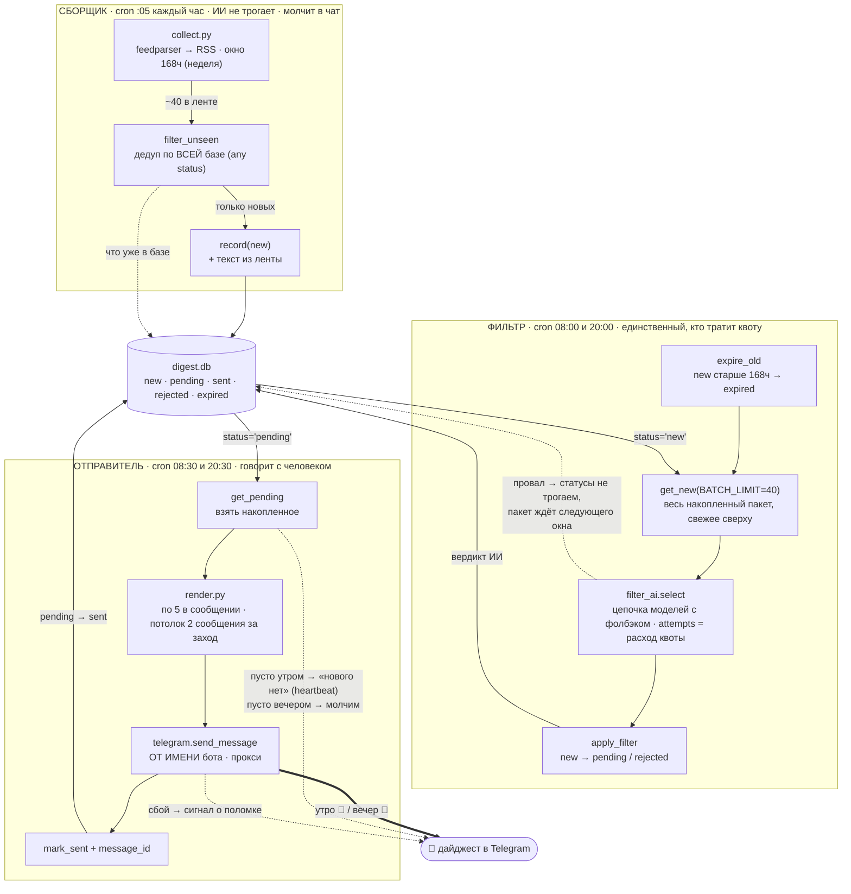
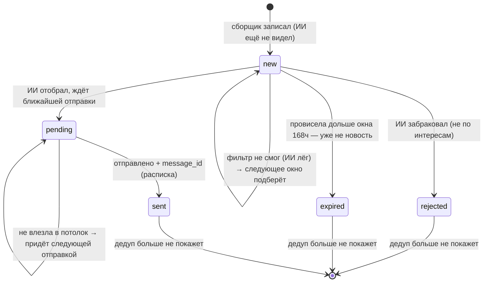

# svc-digest — карта конвейера (урок 6.09; переработан 2026-08-11)

Диаграмма-как-код. Правится вместе с кодом, живёт рядом с ним.

**Архитектура: три развязанные работы, общаются через базу** (producer/consumer).
Сбор, отбор и отправка разделены: к 8:30 дайджест уже лежит готовым в базе —
отправка не зависит от того, живы ли в этот момент RSS и ИИ.

**Ключевая перестройка 2026-08-11.** Раньше работ было две, и ИИ-отбор жил
внутри сборщика — то есть модель звали каждый час. Это давало 7–16 запросов в
сутки при дневной квоте аккаунта 50, **общей с vladburba-bot**, и половина из
них уходила впустую: 11 августа четыре захода потревожили модель ради одной
статьи. Отбор вынесен в отдельную работу с двумя окнами в сутки: сбор стал
бесплатным и частым, отбор — редким и пакетным.

## Три работы



## Жизненный цикл одной новости



## Расход квоты OpenRouter — почему он теперь ограничен конструкцией

Квота **50 запросов в сутки общая на весь аккаунт**, и делится с проектом
`vladburba-bot`. Ключи у проектов разные, но аккаунт один — считает он по
аккаунту. Неудачные попытки тоже списываются.

| | было (ИИ внутри сбора) | стало (отдельный фильтр) |
|---|---|---|
| заходов к ИИ в сутки | до 24 | **2** |
| запросов при полном невезении | 24 × 3 звена = 72 | **2 × 3 = 6** |
| факт на проде | 7 (9 авг) · 16 (10 авг) | ~2 |
| боту остаётся | как повезёт | **44+ из 50** |

Верхняя граница здесь не наблюдение, а свойство устройства: окон два, длина
цепочки три. Поэтому общий счётчик квоты на два проекта решено **не строить** —
он лечил бы проблему, которой больше нет.

## Почему развязка сильнее монолита

| Свойство | Что даёт |
|---|---|
| **Отправка зависит только от Telegram** | 429 от ИИ и падение ленты уехали в другие работы; в 8:30 они не важны — дайджест уже готов |
| **Сборщик бесплатен** | не зовёт ИИ вообще → может ходить хоть каждый час, ничего не стоит |
| **Фильтр видит день целиком** | модель сравнивает статьи между собой и выбирает лучшее, а не судит одну в вакууме |
| **Новости копятся весь день** | вышло в 14:00 — сборщик в 15:00 подобрал; отбор состоится в 20:00 |
| **Дайджест «пре-готовый»** | в базе лежит уже отобранное с выжимками; отправитель не думает, только форматирует |

## Ключевые решения

| Решение | Почему так |
|---|---|
| **ИИ вынесен из сборщика в фильтр** | квота 50/сутки общая с ботом; ежечасный отбор жёг её впустую и мешал модели сравнивать |
| **Два окна фильтрации, а не одно** | ляжет ИИ утром — вечерний отбор уже сделан, дайджест не пустой |
| **Текст новости хранится в базе** (`summary`) | работы развязаны во времени: то, что собрано в 14:00, фильтруется в 20:00 — текст обязан пережить паузу |
| **`expired` для непрожёванного** | статья старше недели выпала из ленты и уже не новость; иначе она вечно занимала бы место в пакете |
| **Пакет свежими вперёд** (`BATCH_LIMIT=40`) | после простоя в модель уходит актуальное, а не хвост недельной давности |
| **`apply_filter` требует `status='new'`** | повторный запуск фильтра (руками, после сбоя) не тронет уже переведённое и не перепишет отправленное |
| **Потолок 2 сообщения за отправку** | 25 новостей четырьмя сообщениями с утра никто не читает; хвост остаётся pending и придёт следующей |
| **Вечерняя отправка молчит при пустой очереди** | утренний heartbeat уже доказал живость; два «нового нет» в день — шум, который перестают замечать |
| **Дедуп по ВСЕЙ базе** (все статусы) | «есть в базе → отбрасываем»; не гоняем через ИИ то, что уже видели |
| **Окно сбора 168ч (неделя), развязано с отправкой** | окно = запас прочности на простой. Повторы режет ДЕДУП, не окно — поэтому широкое окно не даёт дублей |
| **Дедуп по НОМЕРУ статьи** (`habr.com:1068692`), а не по адресу | Habr переносит статью между корпоративными блогами, URL меняется, номер — нет. По адресу переехавшая статья выглядела новой и приходила второй раз (поймано 2026-08-11) |
| **Второй уровень дедупа — по ЗАГОЛОВКУ за неделю** | один текст выходит под двумя разными номерами, и номерной дедуп бессилен: 18.08.2026 «DSL позволяют надежно использовать LLM» пришло дважды. Окно недельное, иначе законные совпадения вроде «Дайджест новостей» начнут глушить свежее |
| **`key` остался естественным ключом, дедуп живёт в отдельной колонке** | в `key` видно, каким адресом статья пришла; заменять его значило бы схлопывать старые записи, то есть терять историю |
| **Отбор — ранжирование, а не фильтр** | потолок 5 за окно = 10 в сутки, ровно столько человек читает. При потоке, где одобряется три четверти, запретами эту задачу не решить: нужно выбирать лучшее из подходящего (решение 2026-08-21 по ручной разметке 60 новостей) |
| **Критерии — иерархия, а не плоский список** | модель ранжирует по ней: 1) ИИ в эксплуатации, 2) Anthropic и Claude, 3) агенты… Плоский список не давал модели повода предпочесть одно другому |
| **Цепочка моделей с фолбэком** | free-тариф отдаёт 429 по воле провайдера |
| **Модель возвращает НОМЕР, не URL** | не может подсунуть выдуманную ссылку — берём оригинал по индексу |
| **outbox: pending → sent + message_id** | «точно ушло» = расписка Telegram; сбой отправки → повтор, не потеря |
| **Своя база, отдельная от бота** | один писатель у SQLite (6.04); PII заявок дайджесту не нужны; свой blast radius |
| **Сигнал в любом исходе — только у отправителя** | сборщик и фильтр молчат в чат; провал отбора человек видит строкой футера |

## Что показывает футер дайджеста

**Правило: каждая строка замкнута сама на себя** — её числа сходятся между
собой и с тем, что человек видит выше в списке.

Утром — промежуточный отчёт, впереди ещё окно в 20:00:
```
📬 Отправлено 5 новостей · очередь пуста
🤖 Отбор: в 08:00 — из 12 выбрал 5
```

Когда поток больше пропускной способности, видно работу буфера:
```
📬 Отправлено 10 новостей · в очереди ещё 3
🤖 Отбор: в 08:00 — из 14 выбрал 6
```

Вечером добавляется итог суток: отбор в 20:00 последний, цифры окончательные:
```
📬 Отправлено 5 новостей · очередь пуста
🤖 Отбор: в 08:00 — из 9 выбрал 5, в 20:00 — из 27 выбрал 5
📊 За сутки: рассмотрено 36 статей · 2 запроса к ИИ
```

Если окно провалилось, вместо чисел стоит «ИИ не ответил», а ниже — сколько
новостей ждёт следующего отбора.

### Три переделки футера — чтобы не пройти их заново

1. **«лента 40 → в окне 168ч 40»** печаталась неизменной 383 захода подряд:
   Habr всегда отдаёт страницу из 40 записей, все моложе недели. Убрано.
2. **«за N часов»**, где N прыгало между 12 и 24 в зависимости от того,
   промолчал ли вечерний выпуск. Заменено явными точками отсчёта.
3. **«собрано 4: отобрано 5, отсеяно 3»** — главная ложь. Складывались РАЗНЫЕ
   множества: собранное за период бралось из `collect_runs`, а вердикты ИИ
   выносятся по накопленной очереди, куда входит собранное раньше. Отсюда
   «отобрано больше, чем собрано». Теперь строка отбора берёт обе цифры из
   ОДНОГО захода (`in_batch` и `selected`) — на боевом журнале эта сумма
   сходится в 12 случаях из 12. Число собранных убрано из футера совсем.

## Известные хвосты (не блокеры)

- ИИ-отбор недетерминирован: пограничные записи проходят то так, то эдак
- Мелкие модели изредка роняют иероглиф/англ. слово в выжимке
- Один источник (расширение по одной ленте)
- Токен бота — копия в двух .env; при ротации два места
- Запросы, сделанные ключом мимо кода (диагностика из консоли), в журнал
  `filter_runs` не попадают — слепое пятно любого своего счётчика
